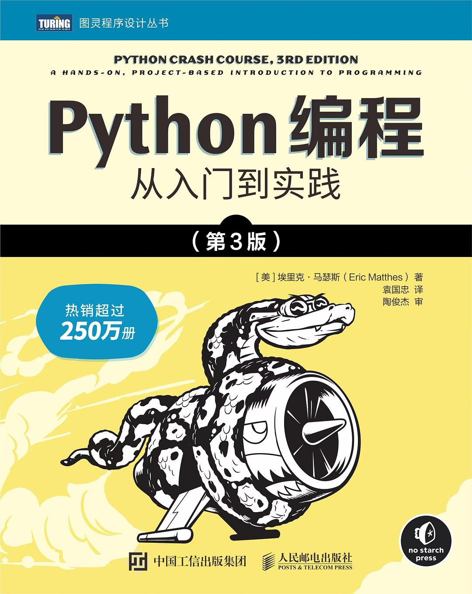

<h2 align="center">Python编程：从入门到实践(第3版)</h2>

- 作者：(美)埃里克•马瑟斯(Eric Matthes)
- 译者：袁国忠
- 评分：9.2

- [第01章 起步](./第01章-起步.ipynb)
- [第02章 变量和简单的数据类型](./第02章-变量和简单的数据类型.ipynb)
- [第03章 列表简介](./第03章-列表简介.ipynb)
- [第04章 操作列表](./第04章-操作列表.ipynb)
- [第05章 if语句](./第05章-if语句.ipynb)
- [第06章 字典](./第06章-字典.ipynb)
