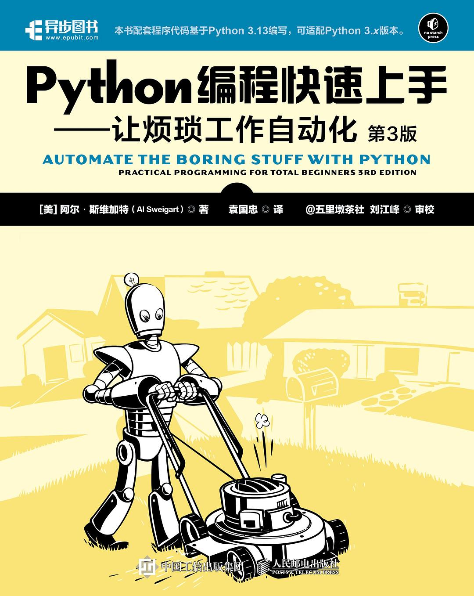

<h2 align="center">Python编程快速上手：让烦琐工作自动化(第3版)</h2>

- 作者: 阿尔•斯维加特(Al Sweigart)
- 译者：袁国忠
- 评分：9.7

- **第一部分　编程基础**
    - [第01章　Python基础](./第01章-Python基础.ipynb)
    - [第02章　if-else和流程控制](./第02章-if-else和流程控制.ipynb)
    - [第03章　循环](./第03章-循环.ipynb)
    - [第04章　函数](./第04章-函数.ipynb)
    - [第05章　调试](./第05章-调试.ipynb)
    - [第06章　列表](./第06章-列表.ipynb)
    - [第07章　字典与数据结构化](./第07章-字典与数据结构化.ipynb)
    - [第08章　字符串与文本编辑](./第08章-字符串与文本编辑.ipynb)
- **第二部分　任务自动化**
    - [第09章　使用正则表达式匹配文本模式](./第09章-使用正则表达式匹配文本模式.ipynb)
    - [第10章　读写文件](./第10章-读写文件.ipynb)
    - [第11章　组织文件](./第11章-组织文件.ipynb)
    - [第12章　设计并部署命令行程序](./第12章-设计并部署命令行程序.ipynb)
    - [第13章　Web内容爬取](./第13章-Web内容爬取.ipynb)
    - [第14章　Excel电子表格](./第14章-Excel电子表格.ipynb)
    - [第15章　Google Sheets](./第15章-GoogleSheets.ipynb)
    - [第16章　SQLite数据库](./第16章-SQLite数据库.ipynb)
    - [第17章　PDF文档和Word文档](./第17章-PDF文档和Word文档.ipynb)
    - [第18章　CSV、JSON和XML文件](./第18章-CSV、JSON和XML文件.ipynb)
    - [第19章　记录时间、调度任务和启动程序](./第19章-记录时间、调度任务和启动程序.ipynb)
    - [第20章　发送电子邮件、短信和通知](./第20章-发送电子邮件、短信和通知.ipynb)
    - [第21章　绘制图形和操作图像](./第21章-绘制图形和操作图像.ipynb)
    - 第22章　识别图像中的文本
    - 第23章　控制键盘和鼠标
    - 第24章　文本转语音引擎和语音识别引擎
