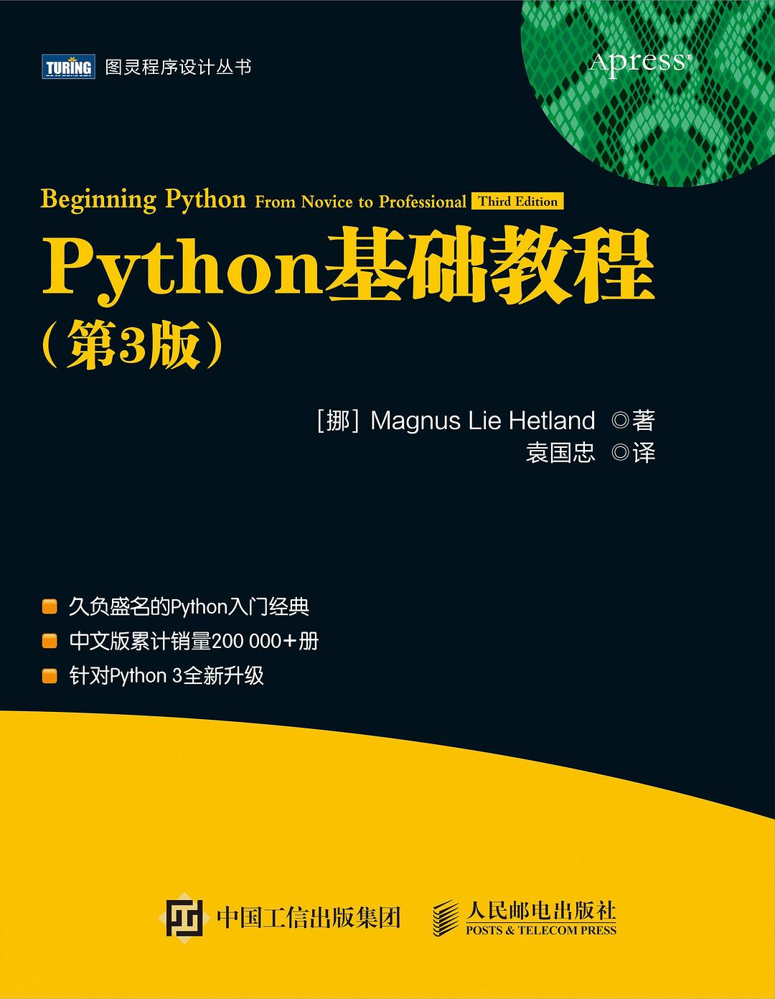

<h2 align="center">Python基础教程(第3版)</h2>

- 作者: 芒努斯·利·海特兰德(Magnus Lie Hetland)
- 译者：袁国忠
- 评分：7.7

- **第一部分 基础篇**
    - [第01章　快速上手：基础知识](./第01章-快速上手：基础知识.ipynb)
    - [第02章　列表和元组](./第02章-列表和元组.ipynb)
    - [第03章　使用字符串](./第03章-使用字符串.ipynb)
    - [第04章　当索引行不通时](./第04章-当索引行不通时.ipynb)
    - [第05章　条件、循环及其他语句](./第05章-条件、循环及其他语句.ipynb)
    - [第06章　抽象(函数)](./第06章-抽象(函数).ipynb)
    - [第07章　再谈抽象(类)](./第07章-再谈抽象(类).ipynb)
    - [第08章　异常](./第08章-异常.ipynb)
    - 第09章　魔法方法、特性和迭代器
    - 第10章　开箱即用
    - 第11章　文件
- **第二部分 应用篇**
    - 第12章　图形用户界面(略)
    - 第13章　数据库支持(略)
    - 第14章　网络编程(略)
    - 第15章　Python和Web(略)
    - 第16章　测试基础(略)
    - 第17章　扩展Python(略)
    - 第18章　程序打包(略)
    - 第19章　趣味编程(略)
- **第三部分 项目篇**
    - 第20章　项目1：自动添加标签(略)
    - 第21章　项目2：绘制图表(略)
    - 第22章　项目3：万能的XML(略)
    - 第23章　项目4：新闻汇总(略)
    - 第24章　项目5：虚拟茶话会(略)
    - 第25章　项目6：使用CGI进行远程编辑(略)
    - 第26章　项目7：自建公告板(略)
    - 第27章　项目8：使用XML-RPC共享文件(略)
    - 第28章　项目9：使用GUI共享文件(略)
    - 第29章　项目10：自制街机游戏(略)
