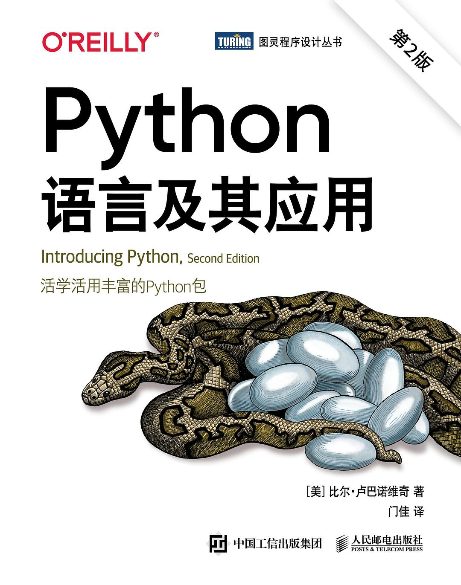

<h2 align="center">Python语言及其应用(第2版)</h2>

- 作者: \[美\]比尔·卢巴诺维奇(Bill Lubanovic)
- 译者：门佳
- 评分：8.4

- **第一部分 Python基础**
    - [第01章　Python初探](./第01章-Python初探.ipynb)
    - [第02章　数据：类型、值、变量和名称](./第02章-数据：类型、值、变量和名称.ipynb)
    - 第03章　数字
    - 第04章　if语句
    - 第05章　字符串
    - 第06章　while循环和for循环
    - 第07章　元组和列表
    - 第08章　字典和集合
    - 第09章　函数和类
    - 第10章　对象和类
    - 第11章　模块、包和赠品
- **第二部分  Python实践**
    - 第12章　数据处理(略)
    - 第13章　日历和时钟(略)
    - 第14章　文件和目录(略)
    - 第15章　进程和并发(略)
    - 第16章　持久性存储(略)
    - 第17章　网络(略)
    - 第18章　Web(略)
    - 第19章　成为Python主义者(略)
    - 第20章　Python的艺术(略)
    - 第21章　工作中的Python(略)
    - 第22章　Python的科学(略)
