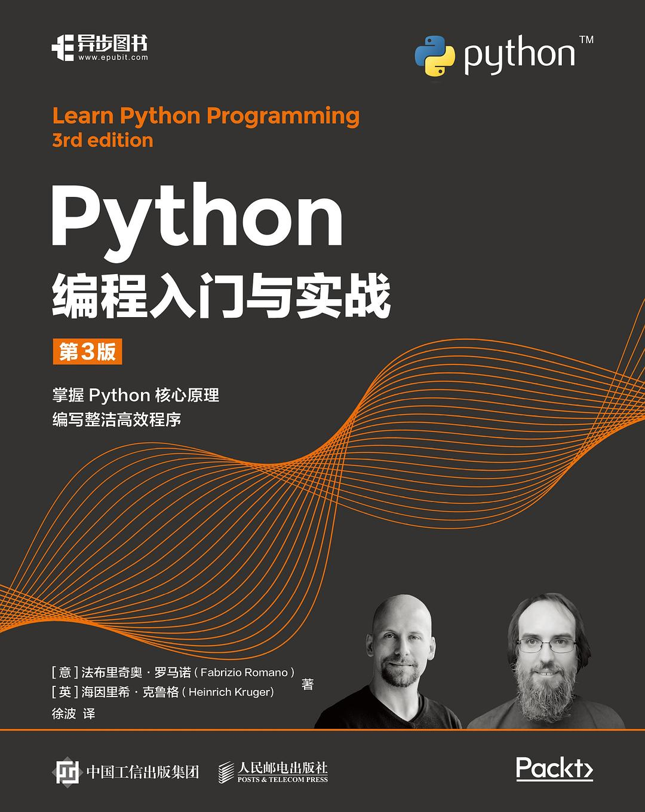

<h2 align="center">Python编程入门与实战(第3版)</h2>

- 作者：\[意\] 法布里奇奥·罗马诺　\[英\] 海因里希·克鲁格
- 译者：徐波
- 评分：评论人数不足

- [第01章　Python概述](./第01章-Python概述.ipynb)
- [第02章　内置的数据类型](./第02章-内置的数据类型.ipynb)
- [第03章　迭代和决策](./第03章-迭代和决策.ipynb)
- [第04章　函数](./第04章-函数.ipynb)
- [第05章　解析和生成器](./第05章-解析和生成器.ipynb)
- 第06章　面向对象编程、装饰器和迭代器
- 第07章　异常和上下文管理器
- 第08章　文件和数据持久化
- 第09章　加密与令牌(略)
- 第10章　测试(略)
- 第11章　调试和性能分析(略)
- 第12章　GUI和脚本(略)
- 第13章　数据科学简介(略)
- 第14章　API开发(略)
- 第15章　打包Python应用程序(略)
