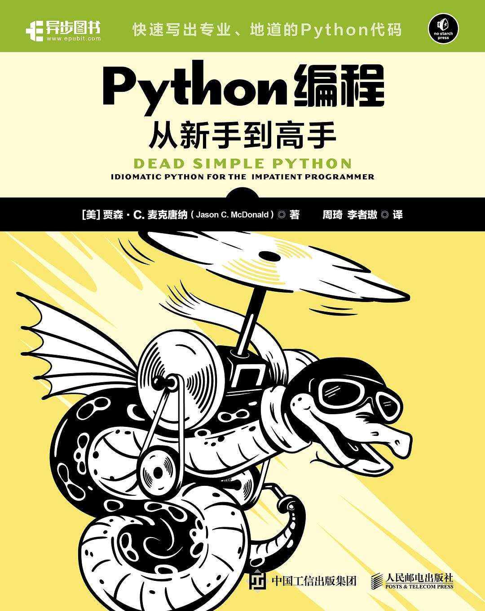

<h2 align="center">Python编程：从新手到高手</h2>

- 作者：\[美\] 贾森·C·麦克唐纳
- 译者：周琦
- 评分：9.2

- **第一部分　Python环境**
    - [第01章　Python的哲学](./第01章-Python的哲学.ipynb)
    - [第02章　Python开发环境](./第02章-Python开发环境.ipynb)
    - [第03章　语法速成课程](./第03章-语法速成课程.ipynb)
    - [第04章　项目结构和代码导入](./第04章-项目结构和代码导入.ipynb)
- **第二部分　基本结构**
    - [第05章　变量和数据类型](./第05章-变量和数据类型.ipynb)
    - [第06章　函数和匿名函数](./第06章-函数和匿名函数.ipynb)
    - [第07章　类和对象](./第07章-类和对象.ipynb)
    - [第08章　错误和异常](./第08章-错误和异常.ipynb)
- **第三部分　数据和流程**
    - [第09章　集合与迭代](./第09章-集合与迭代.ipynb)
    - [第10章　生成器和推导式](./第10章-生成器和推导式.ipynb)
    - [第11章　文本输入/输出和上下文管理](./第11章-文本输入输出和上下文管理.ipynb)
    - 第12章　二进制和序列化
- **第四部分　高级概念**
    - 第13章　继承和混入
    - 第14章　元类和抽象基类
    - 第15章　自省和泛型
    - 第16章　异步和并发
    - 第17章　线程和并行
- **第五部分　超越代码**
    - 第18章　打包和分发
    - 第19章　调试和日志
    - 第20章　测试和剖析
    - 第21章　前路迢迢
